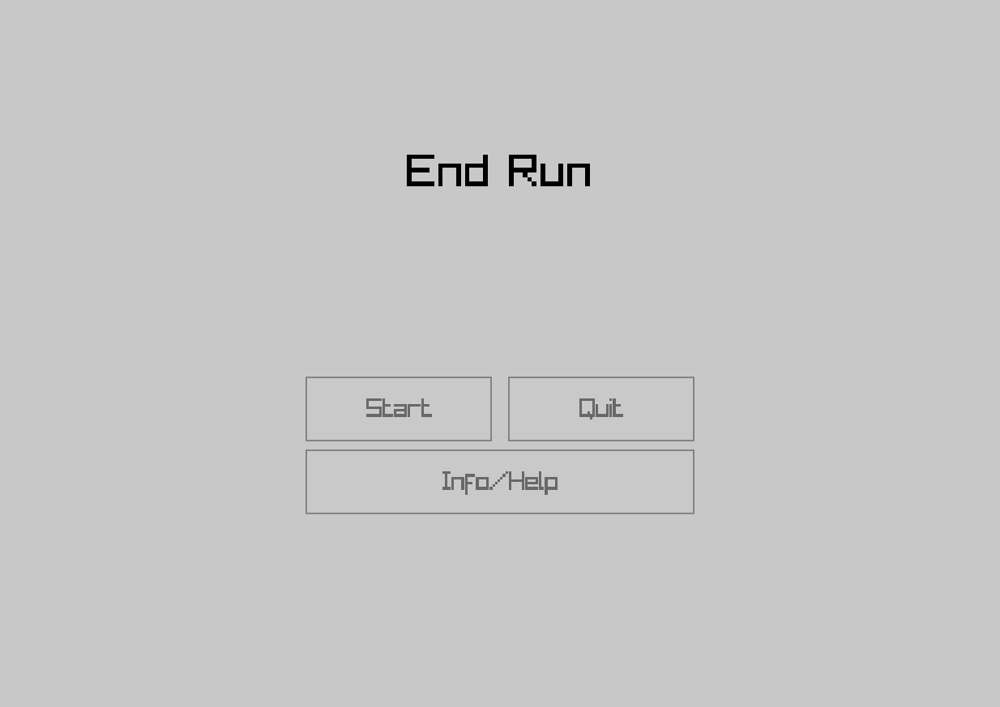
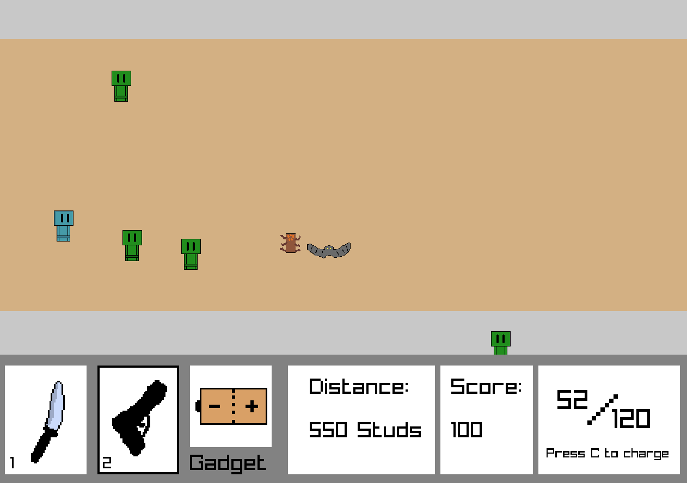
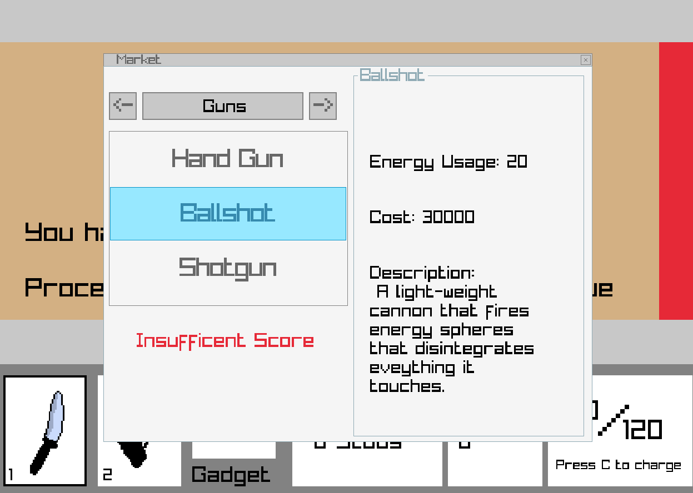
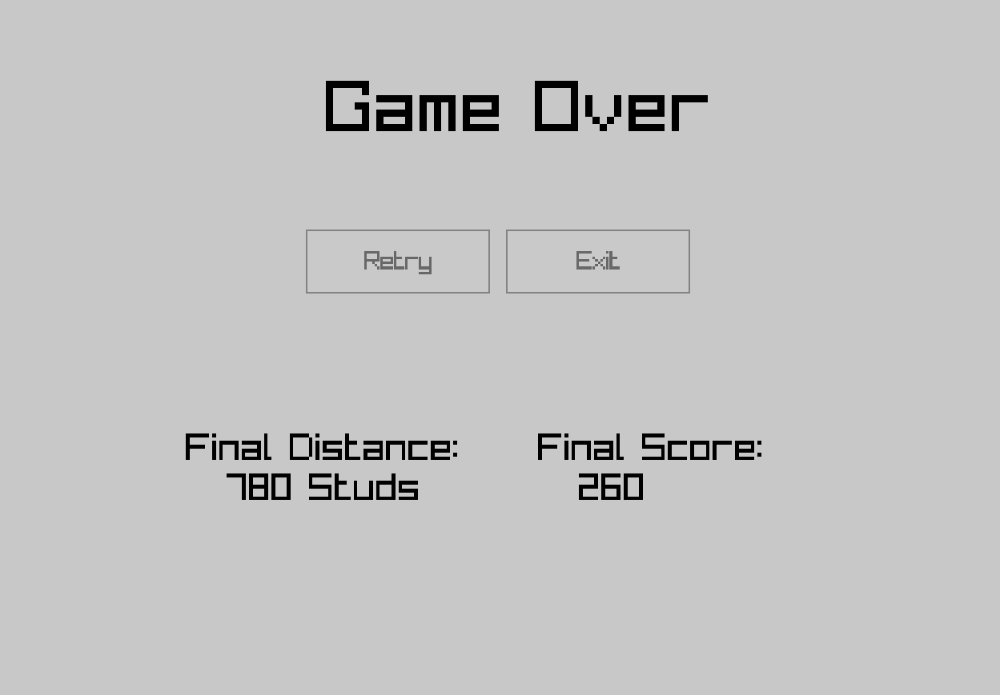

# End Run

This is my second time coding a game with **C#** and **Raylib**, as well as my first time using concepts like **trigonometry**,

**polymorphism**, and **GUI functions** in a game.

## Screenshots

## How it is Made

End Run is coded using the following libraries:

* **Raylib-Cs** by Raylib-cs - C# wrapper for the original Raylib library by Raysan5
* **Raygui-cs-creeperlv by creeperlv** - a C# wrapper for the original RayGui library Raysan5

Both libraries were installed through the NuGet package manager.

All artwork seen in the game was created by me through Aseprite.

## About the Game

This is a top-down survival shooter game, with the main goal of reaching the end of the cave where there are

entities trying to kill you.

In order to survive, you must carefully spend the score you gain from killing the entites on equipment and energy

refills. However, you are one hit in this game, meaning that it is instant death if you make a mistake.

## How to run game

1. Download EndRun\_Windows\_x64.Zip from the latest release in GitHub releases.
2. Extract the folder contents to a place you can find it.
3. Open the extracted folder and run EndRun.exe.

## AI Disclosure

AI was only used for troubleshooting code and for me to learn how to use the Raygui library used. No Ai was used

to generate pieces of code that directly changes how the game works.

## Final Mentions

Once you get the game open, click on the Info/Help button in the menu to learn about the game mechanics. And once

you are done with that, enjoy the game.

